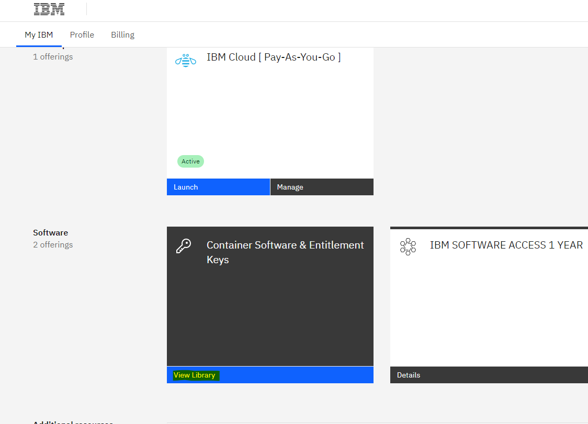
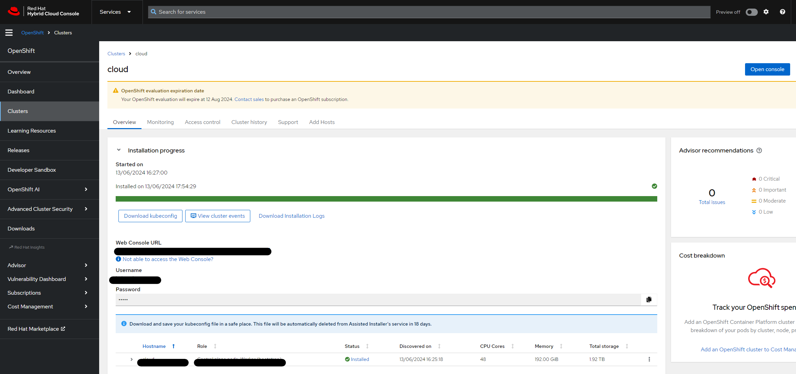

# Introduction

<!-- TODO: annexe -->
[a](README.md/)

# Préparer le PC admin
## Clé publique ssh
Générer le pair de clé publique et privé depuis le PC depuis lequel on va lancer la processus de **Discovery** OpenShift par exemple:
```shell
ssh-keygen -t ed25519
```
> Le but est de permettre aux hôtes d'effectuer des débogages pendant le processus de découverte.

# Identifier le nom de domaine désiré
- Le nom de domaine
> à vérifier sa disponibilité sur [OVH](https://www.ovh.com/fr/order/webcloud/?#/webCloud/domain/select?selection=~())
- Acheter le nom de domaine désiré

# Préparation
## Récupérer les fichier legaux de MAS
### Entitlement Id
Récupérer votre Entitlement key depuis [My IBM](https://myibm.ibm.com/dashboard/)


### License key
Récupérer votre license depuis [IBM License Key Center](https://licensing.flexnetoperations.com/control/ibmr/login?nextURL=%2Fcontrol%2Fibmr%2Fibmrindex)
| Field             | Content                                            |
|-------------------|----------------------------------------------------|
| Number of Keys    | How many AppPoints to assign to the license file   |
| Host ID Type      | Set to Ethernet Address                            |
| Host ID           | Enter any 12 digit hexadecimal string              |
| Hostname          | Set to the hostname of your OCP instance           |
| Port              | Set to 27000                                       |

> [Document de référence](https://ibm-mas.github.io/cli/guides/install/#12-mas-license-file)


## Télécharger Redhat discory disque
1. se connecter sur la [Red Hat Hybrid Cloud Console](https://console.redhat.com)
2. Choisir le produit **OpenShift**
3. Cliquer sur le bouton **Create Cluster**
4. Choisir l'onglet **Datacenter**
5. Cliquer sur le lien **Bare Metal(x86_64)**
6. Choisir l'option **Interactive**
7. Suivis l'instruction pour créer le cluster
	- Etape: Cluster détails
		- Le nom de Cluster
		- Le nom de base domaine
		- La version de OpenShift
		- CPU architecture
		- Cocher la case **Install single node OpenShift(SNO)**
	- Etape: **Operators** ne choisir rien TODO: a vérifier
	- Etape: **Host discovery**
		- Fournir le clé publique généré précédement
		- Cliquer sur le bouton **Generate Discovery ISO**

# Configuration OVH
## Achat de serveur
TODO: A compléter

## Configurer le Bios afin de démarrer le serveur OVH depuis ISO
### Accès IPMI depuis OVH BareMetal server


### Configurer BIOS pour démarrer le serveur OVH avec ISO de Openshift Discovery
1. Charger le fichier ISO sur IPMI
2. Configurer BIOS pour démarrer le serveur OVH depuis ISO

__L'article référentiel__
- version [web](https://support.us.ovhcloud.com/hc/en-us/articles/360000108630-How-to-Install-an-OS-with-IPMI#v2)
- version [pdf](./reference/How%20to%20Install%20an%20OS%20with%20IPMI%20–%20Articles.pdf)

> **Attention:** 
> Nous avons rencontré la difficulte de lancer le fichier .jnpl (java webstart) depuis le PC mastérisé par Capgemini. Finir par réserver une environnement TechZone pour effectuer les opérations nécessaire.


# La processus de Discovery commence
Lorsque le serveur OVH se démarre à partir de ISO Discovery. La processus de Discovery est démarré

## Constat
Depuis l'IHM de la création de cluster de Openshift, l'host du serveur OVH doit s'afficher.
> **Attention:** 
> Lorsque la processus de Discovery se termine, il faut pas oublier à desactiver la démarrage ISO depuis BIOS


## Résultat
Lorsque que la prcessus de discovery se termine, on aura tous les infos de access présent sur la console cluster de votre compte RedHat.



# Générer Certificat pour la domaine
Suite à l'installation la console de OCP utilise par défaut les certificat **selfsigned**, en conséquence il est bloqué par plus part des équipe sécurité dans l'entreprise.

Dans cette étape nous allons installer le certificat validé (par letsencrypt) sur OCP.

[Document référence](https://www.edouard.bzh/guide-certificat-wildcard-lets-encrypt-acmesh-nginx-ovh/)

## Générer certificat
[README](./setup-ocp-sno/README.md)


## Lancer l'installation Maximo Application Suite
### Lancer MAS CLI
```shell
podman run --network=host -ti --rm -v /home/whuang:/mnt/home:Z --pull always quay.io/ibmmas/cli
```
### Lancer installeur MAS
Lancer la commande ci-dessous afin de tracer tous les output d'installation dans un fichier log
```
mas install | tee exemple-install.log
```
**Bon à savoir:** à la fin de l'installation, nous pourrons récupérer la commande d'installation avec tous les paramètres sélectionné pendant la processus interactive. Voici un exemple:
```shell
export IBM_ENTITLEMENT_KEY=xxx
mas install --mas-catalog-version v8-240528-amd64 --accept-license \
  --license-file /mnt/home/license.dat \
  --uds-email 'wei.b.huang@capgemini.com' --uds-firstname 'Wei' --uds-lastname 'HUANG' \
  --storage-rwo 'lvms-vg1' --storage-rwx 'lvms-vg1' --storage-pipeline 'lvms-vg1' --storage-accessmode 'ReadWriteOnce' \
  --mas-instance-id 'adp' --mas-workspace-id 'mas' --mas-workspace-name 'Demo environment for ADP' \
  --mas-channel '8.11.x' --non-prod \
  --manage-channel '8.7.x' \
  --manage-jdbc 'workspace-application' --manage-components 'base=latest' --manage-demodata \
  --db2u-channel 'v110509.0' --db2u-manage \
  --db2u-cpu-request '300m' --db2u-cpu-limit '6000m' --db2u-memory-request '8Gi' --db2u-memory-limit '12Gi' \
  --db2u-backup-storage 10Gi --db2u-data-storage '20Gi' --db2u-logs-storage '10Gi' --db2u-meta-storage '10Gi' --db2u-temp-storage '10Gi' \
  --db2u-manage --db2u-manage-type 'db2wh' \
  --manage-server-bundle-size 'snojms' \
  --manage-base-language 'EN' --manage-secondary-languages 'FR' \
  --manage-server-timezone 'GMT'
```

## Installer le certificat valide pour MAS
### Générer le certificat pour MAS (core et manage)
Lancer la commande ci-dessous pour générer le certificat auprès de "letsEncrypt"
```shell
cd config-mas
./00.generateCertificats.sh <mas-instance-name>
```

A la fin de traitement, vous aurez les chemins de tous les fichiers généré, par exemple:
```shell
[Mon Jun 17 21:38:53 CEST 2024] Your cert is in: /home/whuang/.acme.sh/*.adp.apps.cloud.pbs-eam.com/*.adp.apps.cloud.pbs-eam.com.cer
[Mon Jun 17 21:38:53 CEST 2024] Your cert key is in: /home/whuang/.acme.sh/*.adp.apps.cloud.pbs-eam.com/*.adp.apps.cloud.pbs-eam.com.key
[Mon Jun 17 21:38:53 CEST 2024] The intermediate CA cert is in: /home/whuang/.acme.sh/*.adp.apps.cloud.pbs-eam.com/ca.cer
[Mon Jun 17 21:38:53 CEST 2024] And the full chain certs is there: /home/whuang/.acme.sh/*.adp.apps.cloud.pbs-eam.com/fullchain.cer
```

### Maj le certificat "selfsigned"
Lancer la commande ci-dessous pour remplacer le certificat de MAS par les fichiers de certificat en local
```shell
cd config-mas
./01.setCertificat.sh <mas-instance-name> <private-key-path> <ca-path> <public-key-path>
```

> Attention au chemin des fichiers certificats, à cause de la caractère **"*"**, merci d'ajouter les **"** pour encapsulter les chemin

**Par exemple:**
```shell
./01.setCertificat.sh adp "/home/whuang/.acme.sh/*.adp.apps.cloud.pbs-eam.com/*.adp.apps.cloud.pbs-eam.com.key" "/home/whuang/.acme.sh/*.adp.apps.cloud.pbs-eam.com/ca.cer" "/home/whuang/.acme.sh/*.adp.apps.cloud.pbs-eam.com/*.adp.apps.cloud.pbs-eam.com.cer"
```


## Configurer DBeaver
Pour se connecter à DB2, il faut utiliser NodePort du service `db2u-engn-svc`
1. Récupérer le nom de service
```shell
oc get svc -n db2u  | grep db2u-engn-svc
```
2. identifier NodePort
```shell
oc get svc -n db2u <nom-service-db2u-engn-svc> -o jsonpath='{.spec.ports[?(@.name=="legacy-server")].nodePort}'
```
3. identifier les autres infos de la connexion DB2 (retirer `%` à la fin de output)
```shell
# Récupérer username
oc get secret <mas-instance>-<mas-workspace>-jdbccfg-workspace-application-binding -n mas-adp-manage -ojson | jq -r '.data.username' | base64 -d
# Récupérer password
oc get secret adp-mas-jdbccfg-workspace-application-binding -n mas-adp-manage -ojson | jq -r '.data.password' | base64 -d

# Consulter URL JDBC pour récupérer le nom de base
oc get secret adp-mas-jdbccfg-workspace-application-binding -n mas-adp-manage -ojson | jq -r '.data.url' | base64 -d
```
**Par exemple:**
```shell
oc get secret adp-mas-jdbccfg-workspace-application-binding -n mas-adp-manage -ojson | jq -r '.data.username' | base64 -d
# Récupérer password
oc get secret adp-mas-jdbccfg-workspace-application-binding -n mas-adp-manage -ojson | jq -r '.data.password' | base64 -d

# Consulter URL JDBC pour récupérer le nom de base
oc get secret adp-mas-jdbccfg-workspace-application-binding -n mas-adp-manage -ojson | jq -r '.data.url' | base64 -d
```

[Documentation NodePort](https://docs.openshift.com/container-platform/4.14/networking/configuring_ingress_cluster_traffic/configuring-ingress-cluster-traffic-nodeport.html)
