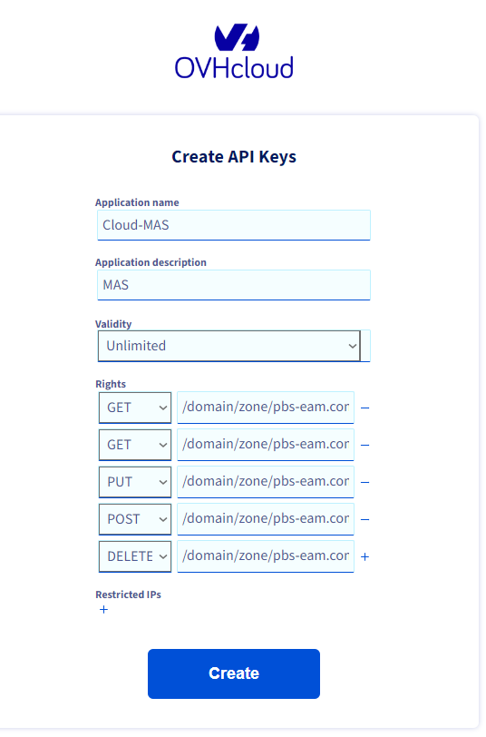

# Prérequis
## Les logiciels ci-dessous sont installé
- curl
- ACME


## initialiser le compte AMCE
```shell
curl https://get.acme.sh | sh -s email=votremail@gmail.com
```

## Récupérer clé API de OVH

> rempalcer tous les domain.dtl par pbs-eam.com

## Configurer account.conf avec les clé API 
location du fichier `~/.acme.sh/account.conf`
```
SAVED_OVH_AK='app key'
SAVED_OVH_AS='app secret'
SAVED_OVH_CK='consumer key'
```

## Spécifier les domaines avec paramètres "-d"
```
./00.00.generateIngressCertificat.sh
```

> Les articles de références:
- https://docs.openshift.com/container-platform/4.14/security/certificates/replacing-default-ingress-certificate.html
- https://docs.openshift.com/container-platform/4.10/security/certificates/api-server.html
- https://www.ibm.com/docs/en/mas-cd/continuous-delivery?topic=management-manual-certificate


## Les lignes de commande pour configurer certifiat de Ingress et API server
TODO: formaliser les code dans un fichier sh
```shell
oc create configmap letsencrypt-ca --from-file=ca-bundle.crt=ca.cer -n openshift-config
# configmap/letsencrypt-ca created

oc patch proxy/cluster --type=merge --patch='{"spec":{"trustedCA":{"name":"letsencrypt-ca"}}}'
# proxy.config.openshift.io/cluster patched


# Il est possible de lancer "oc set data secret/letsencrypt-tls -n openshift-ingress --from-file=tls.crt=apps.cloud.pbs-eam.com.cer && oc set data secret/letsencrypt-tls -n openshift-ingress --from-file=tls.key=apps.cloud.pbs-eam.com.key" pour MAJ le secret (la renouvellement)
oc create secret tls letsencrypt-tls --cert=apps.cloud.pbs-eam.com.cer --key=apps.cloud.pbs-eam.com.key -n openshift-ingress
# secret/letsencrypt-tls created

#################################
# Ingress
#################################
oc patch ingresscontroller.operator default --type=merge -p '{"spec":{"defaultCertificate": {"name": "letsencrypt-tls"}}}' -n openshift-ingress-operator
# ingresscontroller.operator.openshift.io/default patched

oc create secret tls letsencrypt-tls --cert=apps.cloud.pbs-eam.com.cer --key=apps.cloud.pbs-eam.com.key -n openshift-config
# secret/letsencrypt-tls created

#################################
# API server
#################################
oc patch apiserver cluster --type=merge -p '{"spec":{"servingCerts": {"namedCertificates": [{"names": ["api.cloud.pbs-eam.com"], "servingCertificate": {"name": "letsencrypt-tls"}}]}}}'
# apiserver.config.openshift.io/cluster patched
```


## Activer registry
[Document](https://docs.openshift.com/container-platform/4.14/registry/configuring_registry_storage/configuring-registry-storage-baremetal.html#registry-configuring-storage-baremetal_configuring-registry-storage-baremetal)
`oc edit configs.imageregistry.operator.openshift.io`
> ```yaml
> storage:
>  pvc:
>    claim:
> ```

`oc edit configs.imageregistry/cluster`
> ```
> managementState: Managed
> ```
